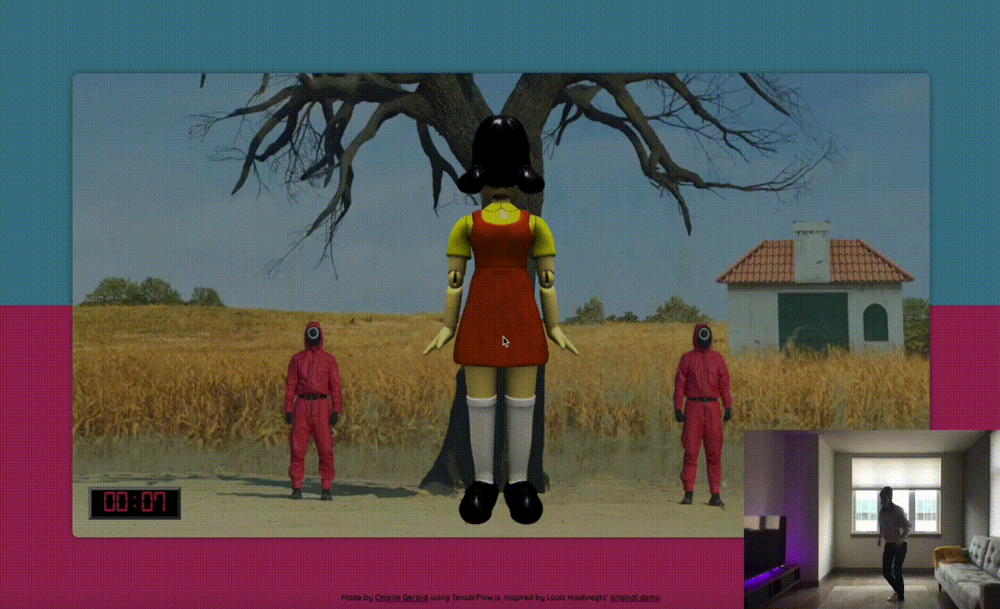

# Squid Game's "Red light, green light" with movement detection using TensorFlow.js

Heavily inspired by [this original work](https://codepen.io/Mamboleoo/pen/abydvaG) by [Louis Hoebregts](https://twitter.com/Mamboleoo) that is using face detection, I built on top of it to add full-body movement detection using TensorFlow.js.

I built it in a few hours so this is meant to be a prototype but feel free to try the [live demo](https://squid-game-tfjs.netlify.app).

## Running locally

With the Netlify CLI installed, run `ntl dev` to start a server using HTTPS.
